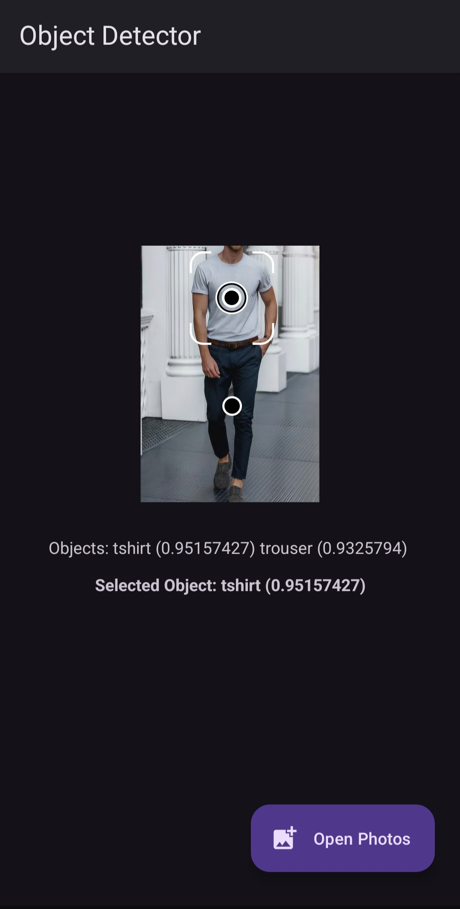

# Object Detector

This android app lets users select an image from their device and detects all trained objects in the image using a YOLOv5 model converted to TensorFlow Lite.

Currently, the app is configured with a custom-trained model for clothing detection, but you can train your own YOLOv5 model and integrate it into the app.

---

## Features

- Select an image from gallery
- Detect multiple objects in the image
- Display labels with confidence scores
- Easy integration of custom-trained TFLite models

---

## Demo

